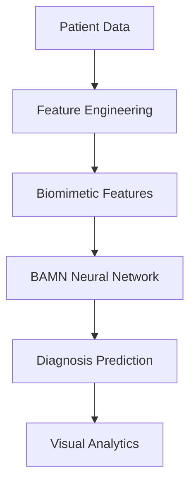

# BioAdaptive EyeML Diagnosis

A state-of-the-art ocular diagnosis tool leveraging biomimetic machine learning to analyze eye movement patterns and predict ocular conditions with clinical-grade accuracy.

## Features 

- **Advanced Visualization** - Interactive Plotly charts for data exploration
- **Biomimetic Feature Engineering** - Models inspired by human visual pathways
- **Clinical Workflow Integration** - Designed for real-world diagnostic use
- **Secure Model Loading** - PyTorch 2.6+ compatible with proper safety measures

## Installation

1. Clone the repository:
```bash
git clone https://github.com/abidhasanrafi/BioAdaptive-EyeML-Diagnosis.git
cd BioAdaptive-EyeML-Diagnosis
```

2. Install dependencies:
```bash
pip install -r requirements.txt
```

3. Download the pre-trained model files and place them in the project root:
- `bioadaptive_mlp_model.pth`
- `preprocessing_objects.pkl`

## Usage

Run the Streamlit app:
```bash
streamlit run app.py
```

### Input Parameters
| Parameter | Description | Range |
|-----------|-------------|-------|
| Age | Patient age in years | 0-100 |
| Sex | Patient gender | Male/Female |
| Visual Acuity (logMAR) | Right/Left eye measurement | -0.3 to 3.0 |
| Eye Movement | Degrees of movement | ±10.0 |
| Session Data | Measurement session info | 1+ |

## Technical Architecture



### Model Specifications
| Component | Details |
|-----------|---------|
| Architecture | BioAdaptiveMLP (BAMN Blocks) |
| Input Features | 18 engineered features |
| Hidden Layers | 128 → 64 neurons |
| Activation | GELU with gating mechanism |
| Dropout | 0.15 |
